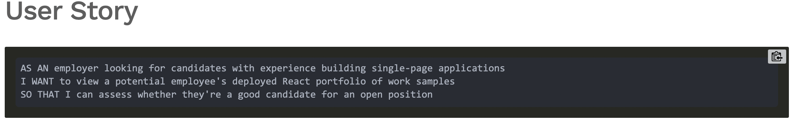
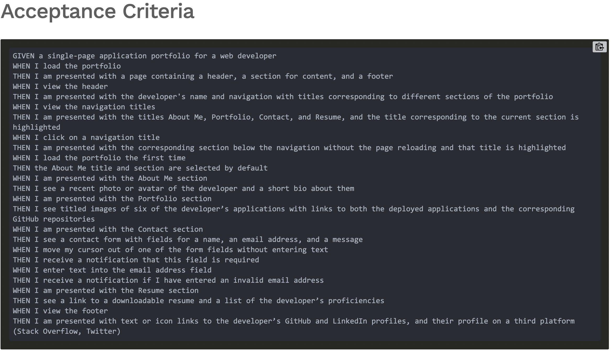

# React Portfolio

# Table of Contents 
* [Description](#description) 
* [Installation](#installation)
* [License](#license)
* [Contributing](#contributing)
* [Questions](#questions)
        
## Description 
Being a web developer means being part of a community. You’ll need a place to share your projects not only if you're applying for jobs or working as a freelancer but also so that you can share your work with fellow developers and collaborate on future projects.

Now that you’ve completed multiple projects, your task is to create a portfolio, using your new React skills to help set you apart from other developers whose portfolios don’t use the latest technologies.

### User Story 

### Acceptance Criteria 

## Installation
to use this application one must install 
* idb
* react-parallax

* Run 'npm install'
* 'npm start'
* 'npm run build' 

## License 
MIT license 

## Contributing 
William Wright

## Questions
Reach out to me regarding question at,
    * Github: <a href="https://github.com/wrightw404">wrightw404</a>
    * Email: <a href="mailto:Wrightw404@gmail.com">Wrightw404@gmail.com</a>